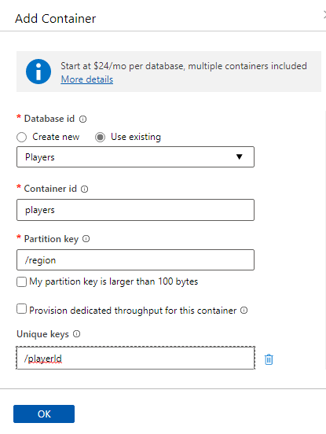
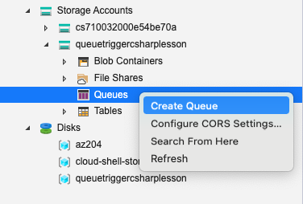
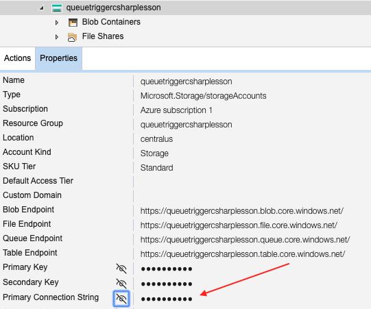

# Cosmos DB Trigger & Bindings

## Goal 🎯

The goal of this lesson is to learn about how to trigger a function by adding a document to Cosmos DB, how to use input and output bindings, the usage of Azure KeyVault and dependency injection in functions using Cosmos DB.

This lessons consists of the following exercises:

|Nr|Exercise
|-|-
|1|Running the Azure Cosmos DB Emulator
|2|Using the Cosmos DB output binding
|3|Using the Cosmos DB input binding
|4|Creating a Cosmos DB Trigger function
|5|Using Azure KeyVault for storing the connection string
|6|Reusing the Cosmos DB connection with dependency injection
|7|Deploying to Azure


> 📝 **Tip** - If you're stuck at any point you can have a look at the [source code](../src) in this repository

---

## Brief introduction to triggers and bindings.

In this exercise, we'll use triggers and bindings in Azure Functions, this is important to distinguish the difference between the two. 

A trigger defines how a function is invoked, and a function must have exactly one trigger. Triggers have associated data, which is often provided as the payload of the function.
A Binding to a function is a way of declaratively connecting another resource to the function; bindings may be connected as input bindings, output bindings, or both. Data from bindings is provided to the function as parameters. Input bindings are the data the function receives. Output bindings are the data the function sends.

You can mix and match different bindings to suit your needs. Bindings are optional and a function might have one or multiple input and/or output bindings.
More details about bindings can be reviewed at the [official Microsoft Documentation](https://docs.microsoft.com/en-us/learn/modules/chain-azure-functions-data-using-bindings/).

## 1. Running the Azure Cosmos DB Emulator

For this exercise we'll look into Cosmos DB Emulator to see how you can interact with Containers and Queries in your local environment

### Steps

1.
2.
3.

## 2. Using the Cosmos DB output binding

For this practice, we'll be creating a QueueTrigger function and use the Cosmos DB output binding with a `player` type in order to read messages from the `newplayer-items` queue, that you have used previously in the queue lesson. Let's imagine the following scenario: you need to read new messages from a queue, make a simple transformation to the data and then save it into Cosmos DB.

Here is the list of requirements:

- VS Code
- Azure Functions Extension.
- An Azure Subscription

### Steps

2.1 Create the queue `newplayer-items`. There are two options for this step: use your Azure account or a local account to work in your local development environment.
For demo purposes, we'll opt for the second option.

If you work in Windows you can use the official Azure Storage Emulator and the Azure Storage Explorer app.

For OS X and Linux must be used Azurite which is a Cross-Platform emulator. The last version at the moment of writing this tutorial is 3.10. The step by step instructions to install it can be found [here](https://github.com/azure/azurite#npm).

Using HTTPS

> 🔎 **Observation** - A recommendation for your connections with Azurite, use HTTPS. That way your code won't have to be changed when you move your code to production.

2.2 Create your Azure Functions Project that will contain the following functions:

- Queue triggered function, for reading the message from the queue that will be stored in Cosmos DB, using a queue trigger and Cosmos DB output binding.

In VS Code create a new Azure Function Project, by selecting the Functions section of your Azure Extensions, or using the Command Palette (cmd + shift + p).

Set the folder location and language, C# for this tutorial. At the step of selecting a template, select `skip for now` for creating an empty project.


2.3 Add the Queue triggered function.

The first function to add is the one that will read the messages from the queue. 

2.4 In VS Code click on the `Add function` button or use (cmd + shift + p) in OSx to open the Command Palette and select the Create function option.


2.5 Select the `QueueTrigger` template for your function. Give it a name, a name for the namespace, and select the Create new local app setting to store the connection string, as shown in the image.


2.5 Next, select the Azure subscription with the Storage Account, or create a new one.
If you need a more detailed guide for these steps you can follow the Queue lesson of the Azure Functions University at this [link](https://github.com/marcduiker/azure-functions-university/blob/main/lessons/queue.md#71-creating-a-default-queue-triggered-function)

2.6 Give the name to the queue, you can leave the default or use `newplayer-items`, just make sure the queue you will be using has the name you use in your function parameter.

2.7 Set up and create the queue locally.

In this tutorial, we used Azurite, make sure to have the Azurite service running. For starting the service with Https use:

```bash
azurite --silent --location <installed location> --debug <installed location>/debug.log --oauth basic --cert 127.0.0.1.pem --key 127.0.0.1-key.pem
```

The default endpoint used for the queue service is https://127.0.0.1:10001. This is the endpoint that will be used to attach the Azure Storage Explorer for the queue storage Account.

Now, at the Azure Storage emulator add the new connection with the ports indicated in your Azurite service. The values shown in the image are the defaults:


For the queues is used 10001.

Use the ports setup that is more convenient for your environment. There are several settings that can be customized. To get more details, check out the getting started [official guide](https://github.com/Azure/Azurite#getting-started)

After the connection is attached there should be three categories under the connection tree, select `Queues` and create the `newplayer-items` queue, or the name of your preference. Once the queue is added, It should be looking as the image below:


Now, back at the VS Code. 

2.8 Edit the Function code.

Add the name of the queue and the connection setting to the queue trigger.

```csharp
 public static void Run([QueueTrigger("newplayer-items", Connection = "queueConnection")]string myQueueItem
```

Since there is a new `queueConnection` setting, it has to be added to the local.settings.json file

```json
{
  "IsEncrypted": false,
  "Values": {
    "AzureWebJobsStorage": "UseDevelopmentStorage=false",
    "FUNCTIONS_WORKER_RUNTIME": "dotnet",
    "queueConnection": "DefaultEndpointsProtocol=https;AccountName=devstoreaccount1;AccountKey=Eby8vdM02xNOcqFlqUwJPLlmEtlCDXJ1OUzFT50uSRZ6IFsuFq2UVErCz4I6tq/K1SZFPTOtr/KBHBeksoGMGw==;QueueEndpoint=https://127.0.0.1:10001/devstoreaccount1;"
  }
}

```

Create the Cosmos DB database locally

We need to have the Cosmos DB emulator for running everything in our local environment. 
For using the Cosmos DB emulator in OS X follow the official guide from the Microsoft Docs at this [link](https://docs.microsoft.com/en-us/azure/cosmos-db/local-emulator?tabs=cli%2Cssl-netstd21#run-on-linux-macos) 

In summary, you will have to create a Windows Virtual Machine hosted in Parallels or Virtual Box. Then establish the connection between the host and the guest machines and finally set up the certificate to use the HTTPS connection in OS X. If you run into any issues with this setup you can take a look at this [github issue](https://github.com/Azure/Azure-Functions/issues/1797) for troubleshooting or you can opt for creating an actual Cosmos DB in Azure instead of using the emulator.

Open your Cosmos DB Emulator and select the `New Database` button at the toolbar. We will name it `Players`. The next step is adding a new container. Keep in mind that the actual data of a Cosmos DB is stored in containers. Let's add a new one named `players`. Here is where the data from the queue will be saved.

Take a look at the below image for reference.

 

When you add the new container you have to define the container key. This is a very important setting, since this will be used to scale your Cosmos DB. The container key should be picked based on the distribution of the data. Here is an extract from the Microsoft docs:

>"If you choose a partition key that evenly distributes throughput consumption across logical partitions, you will ensure that throughput consumption across physical partitions is balanced."


For this exercise, our Partition Key will be `region`, and also we will add a unique key using the `playerId` field.

 


> 🔎 **Observation** - If you are interested in learning more about how the partition key impacts the performance of your application check out [this](https://docs.microsoft.com/en-us/azure/cosmos-db/partitioning-overview) page from the official docs.

Add the connection string to your Azure Function.

Now that we have the Cosmos DB created locally, let's set up the Azure Function to use the local connection string.

Get the connection string from the local emulator:

 

Since we are running the local emulator in a hosted virtual machine we have to change the IP of localhost to the IP of the virtual machine. After getting the IP from the VM, remove localhost and use the actual IP address. Finally add it to the local.settings.json file.

```json
{
  "IsEncrypted": false,
  "Values": {
    "AzureWebJobsStorage": "UseDevelopmentStorage=false",
    "FUNCTIONS_WORKER_RUNTIME": "dotnet",
    "queueConnection": "DefaultEndpointsProtocol=https;AccountName=devstoreaccount1;AccountKey=Eby8vdM02xNOcqFlqUwJPLlmEtlCDXJ1OUzFT50uSRZ6IFsuFq2UVErCz4I6tq/K1SZFPTOtr/KBHBeksoGMGw==;QueueEndpoint=https://127.0.0.1:10001/devstoreaccount1;",
    "CosmosDBConnection": "AccountEndpoint=https://192.168.7.108:8081/;AccountKey=C2y6yDjf5/R+ob0N8A7Cgv30VRDJIWEHLM+4QDU5DE2nQ9nDuVTqobD4b8mGGyPMbIZnqyMsEcaGQy67XIw/Jw==;"
  }
}
```

Add a CosmosDB output binding to your Run method.

Inside of VS Code, open the QueueTriggerCSharp1.cs file, where the Run method definition was created. 

Add the following binding definition:
```csharp
[CosmosDB(
        databaseName: "Players",
        collectionName: "players",
        ConnectionStringSetting = "CosmosDBConnection")]out dynamic document

```

After adding the output binding the signature of the Run method should look like the following:

```csharp
 public static void Run([QueueTrigger("newplayer-items", Connection = "queueConnection")]string myQueueItem,
                [CosmosDB(
                databaseName: "Players",
                collectionName: "players",
                ConnectionStringSetting = "CosmosDBConnection")]out dynamic document,
                 ILogger log)
```

Save your changes.

Add a Player.cs model to the Azure Function application.

For this exercise, we need to map the item from the queue to an Entity that can be deserialized to a C# object, and make the required transformations, and then deserialize this object to save it in CosmosDB.

Add a new folder called Models, and add a new C# class inside of it. Call it Player.

Add the following content to this class.

```csharp

using Newtonsoft.Json;

namespace AzureFunctionsUniversity.Demo.Cosmos.Models
{
    public class Player
    {
        public Player()
        {
        }

        [JsonProperty("id")]
        public string Id { get; set; }
        
        [JsonProperty("nickName")]
        public string NickName { get; set; }
        
        [JsonProperty("playerId")]
        public int playerId { get; set; }
        
        [JsonProperty("region")]
        public string Region { get; set; }
    }
}

```

Save your changes.

2.9 Modify the content of the Run method.

At the Run method, get the message from the queue, do a simple transformation and then send the resulting data to Cosmos DB.

The final code is shown below:

```csharp
public static class QueueTriggerCSharp1
    {
        [FunctionName("QueueTriggerCSharp1")]
        public static void Run([QueueTrigger("newplayer-items", Connection = "queueConnection")]string myQueueItem,
                [CosmosDB(
                databaseName: "Players",
                collectionName: "players",
                ConnectionStringSetting = "CosmosDBConnection")]out dynamic document,
                 ILogger log)
        {            
            log.LogInformation($"C# Queue trigger function processed: {myQueueItem}");
            Player player = JsonConvert.DeserializeObject<Player>(myQueueItem);

            //The code for the data transformation should be added here
            player.NickName = player.NickName.ToUpperInvariant();
            
            // return the player data in the document variable used by the output binding 
            document = player;

            log.LogInformation($"C# Queue trigger function inserted one row");
            log.LogInformation($"Description={myQueueItem}");

        }
    }

```

Make sure to add a reference to the `Microsoft.Azure.WebJobs.Extensions.CosmosDB` package. For adding the package to your app, run the `dotnet add package Microsoft.Azure.WebJobs.Extensions.CosmosDB` command.
 
Run your function locally to make sure it is correctly connected to the queue and listens to the new message event trigger. Remember that if you need more detailed instructions about the queue trigger you can always review them in the [Queue lesson](https://github.com/marcduiker/azure-functions-university/blob/main/lessons/queue.md#71-creating-a-default-queue-triggered-function).

Once your function is running, add a new message to the queue using the Azure Storage Explorer, select the `newplayer-items` queue then click on the `+ Add message` button for adding the following json data:

```json
{
   "nickName": "Samuel",
   "playerId": 1,
   "region": "United States of America"
}
```
You should see an image very similar to the below one:

 

After adding the message to the queue, the Azure Function should listen to the event and the Run method executed.

Here's an example of the output messages, once the message was added to the queue, and then saved into Cosmos DB.

 

Go to your Cosmos DB local emulator and verify that the item was added to the `Players` container. You should see the list of items very similar to the below image:

 


2.10 Deploying to Azure 

For deploying the Azure Function there are several options. All the methods are explained in the Deployment lesson of the Azure Functions university [here](https://github.com/marcduiker/azure-functions-university/blob/main/lessons/deployment.md).

In this exercise, we'll use VS Code to do the deployment.

Select your Azure Extension. It should already display the subscription that you have for your Azure Account. Select the Azure Function and click on the Deploy Button indicated in the following image:

 

Indicate the unique global name, the stack, and the region for the new function.


Check the output of the deployment task to review if there is any error.


> 🔎 **Observation** - Notice that there is a Function App, and a Storage Account with the same name as the function.

Besides deploying a new Function App, you have to create in your Azure Subscription, a new Azure Cosmos DB and a Players container. 
Follow the first three sections of [this](https://docs.microsoft.com/en-us/azure/cosmos-db/create-cosmosdb-resources-portal#create-an-azure-cosmos-db-account) tutorial from the Microsoft Docs to create your first Cosmos DB.

Following, you also have to create a new queue named `newplayer-items`, using the same Azure Storage Account. For this step you can use the Azure Storage Explorer.

All the details on how to add the queue can be reviewed at the Queue lesson.



After the Queue is added, the Storage Account should look very similar to the following image:


2.11 Add the connection string to your function App.

There are two connection strings that should be added to the settings of the Azure Function: 

- `queueConnection`

- `CosmosDBConnection`

The names of both connections must be the same as the code deployed.

Using the Azure Storage Explorer, copy the Connection String from the queue and add it with the queueConnection setting:




In the Azure portal, go to `Home` then `Function App`, select the deployed function, and configuration from the left panel under `Settings` section. Under `Application Settings`, select the `New application setting` button, and add the queueConnection setting. 

Again, in the Azure Portal, go to `Home`, then `Azure Cosmos DB`, select your `Cosmos DB` with the `Players` container. Then at the left panel, under the `Settings` section, click on `Keys`, copy the `Primary Connection String`.
Go back to the `Application Settings` of the Azure Function and select the `New application setting` button, and add the CosmosDBConnection setting. 

Once both settings have been added, you should see both listed as shown at the below image.


> 🔎 **Observation** - Notice that even though both settings are connection strings these are added as Application Settings. The only Connection Strings that have to be in the Connection String section are Entity Framework connection strings.

At this point, the Azure Function with the output binding is fully set up to start reading from the queue and adding items to Cosmos DB. You can test it out using the Azure Storage Emulator just exactly as it was done when working locally, just now you are using the queue from your Azure Subscription. Try it out and make sure everything works as expected.


## 3. Using the Cosmos DB input binding

### Steps

## 4. Creating a Cosmos DB Trigger function

### Steps


## 5. Using KeyVault for the connection string 

### Steps

## 6. Reusing the Cosmos DB connection with dependency injection

### Steps

## 7. Deploying to Azure

### Steps

## More info

For more info about Cosmos DB and bindings for Azure Functions have a look at the official [Azure Cosmos DB Bindings](https://docs.microsoft.com/en-us/azure/azure-functions/functions-bindings-cosmosdb-v2) documentation.

---
[◀ Previous lesson](cosmos.md) | [🔼 Index](_index.md) | [Next lesson ▶](table.md)
