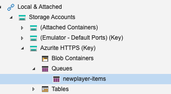
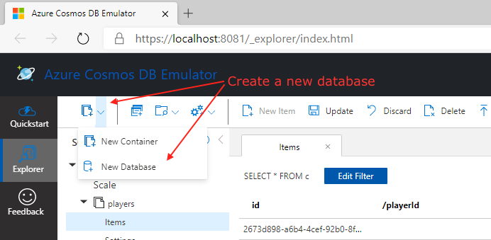
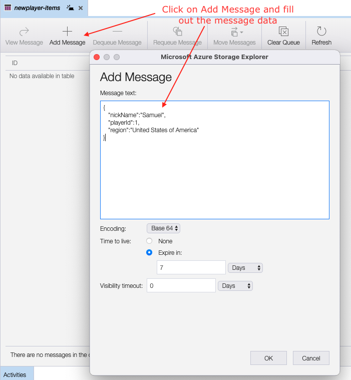
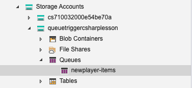
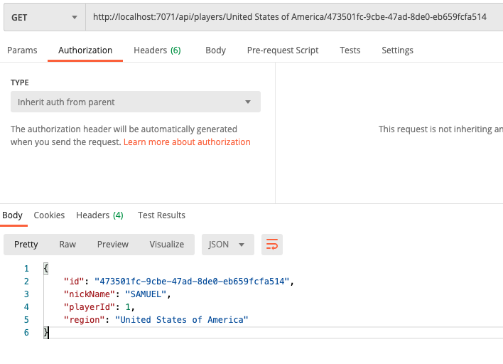
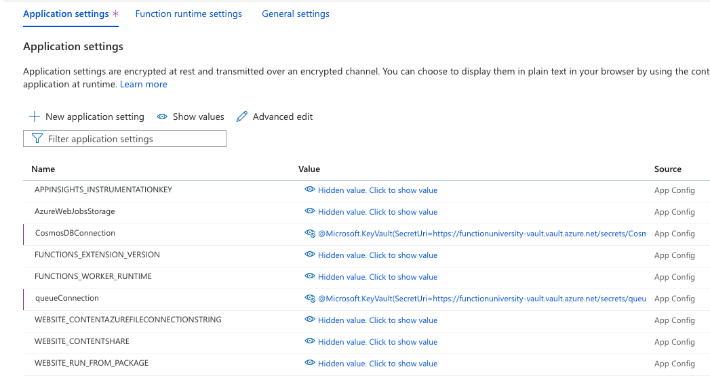

# Cosmos DB Trigger & Bindings

## Goal 🎯

The goal of this lesson is to learn about how to trigger a function by adding a document to Cosmos DB, how to use input and output bindings, the usage of Azure KeyVault and dependency injection in functions using Cosmos DB.

This lessons consists of the following exercises:

|Nr|Exercise
|-|-
|1|Running the Azure Cosmos DB Emulator
|2|Using the Cosmos DB output binding
|3|Deploying to Azure
|4|Using the Cosmos DB input binding
|5|Creating a Cosmos DB Trigger function
|6|Using Azure KeyVault for storing the connection string
|7|Reusing the Cosmos DB connection with dependency injection


> 📝 **Tip** - If you're stuck at any point you can have a look at the [source code](../src) in this repository

---

## Brief introduction to triggers and bindings.

In this exercise, we'll use triggers and bindings in Azure Functions, this is important to distinguish the difference between the two. 

A trigger defines how a function is invoked, and a function must have exactly one trigger. Triggers have associated data, which is often provided as the payload of the function.
A Binding to a function is a way of declaratively connecting another resource to the function; bindings may be connected as input bindings, output bindings, or both. Data from bindings is provided to the function as parameters. Input bindings are the data the function receives. Output bindings are the data the function sends.

You can mix and match different bindings to suit your needs. Bindings are optional and a function might have one or multiple input and/or output bindings.
More details about bindings can be reviewed at the [official Microsoft Documentation](https://docs.microsoft.com/en-us/learn/modules/chain-azure-functions-data-using-bindings/).

## 1. Running the Azure Cosmos DB Emulator

For this exercise we'll look into Cosmos DB Emulator to see how you can interact with Containers and Queries in your local environment

### Steps

1.
2.
3.

## 2. Using the Cosmos DB output binding

For this practice, we'll be creating a QueueTrigger function and use the Cosmos DB output binding with a `player` type in order to read messages from the `newplayer-items` queue, that you have used previously in the queue lesson. Let's imagine the following scenario: you need to read new messages from a queue, make a simple transformation to the data and then save it into Cosmos DB.

Here is the list of requirements:

- VS Code
- Azure Functions Extension.
- An Azure Subscription

### Steps

2.1 Create the queue `newplayer-items`. There are two options for this step: use your Azure account or a local account to work in your local development environment.
For demo purposes, we'll opt for the second option.

If you work in Windows you can use the official Azure Storage Emulator and the Azure Storage Explorer app.

For OS X and Linux must be used Azurite which is a Cross-Platform emulator. The last version at the moment of writing this tutorial is 3.10. The step by step instructions to install it can be found [here](https://github.com/azure/azurite#npm).

Using HTTPS

> 🔎 **Observation** - A recommendation for your connections with Azurite, use HTTPS. That way your code won't have to be changed when you move your code to production.

2.2 Create your Azure Functions Project that will contain the following functions:

- Queue triggered function, for reading the message from the queue that will be stored in Cosmos DB, using a queue trigger and Cosmos DB output binding.

In VS Code create a new Azure Function Project, by selecting the Functions section of your Azure Extensions, or using the Command Palette (cmd + shift + p).

Set the folder location and language, C# for this tutorial. At the step of selecting a template, select `skip for now` for creating an empty project.


2.3 Add the Queue triggered function.

The first function to add is the one that will read the messages from the queue. 

2.4 In VS Code click on the `Add function` button or use (cmd + shift + p) in OSx to open the Command Palette and select the Create function option.


2.5 Select the `QueueTrigger` template for your function. Give it a name, a name for the namespace, and select the Create new local app setting to store the connection string, as shown in the image.


2.5 Next, select the Azure subscription with the Storage Account, or create a new one.
If you need a more detailed guide for these steps you can follow the Queue lesson of the Azure Functions University at this [link](https://github.com/marcduiker/azure-functions-university/blob/main/lessons/queue.md#71-creating-a-default-queue-triggered-function)

2.6 Give the name to the queue, you can leave the default or use `newplayer-items`, just make sure the queue you will be using has the name you use in your function parameter.

2.7 Set up and create the queue locally.

In this tutorial, we used Azurite, make sure to have the Azurite service running. For starting the service with Https use:

```bash
azurite --silent --location <installed location> --debug <installed location>/debug.log --oauth basic --cert 127.0.0.1.pem --key 127.0.0.1-key.pem
```

The default endpoint used for the queue service is https://127.0.0.1:10001. This is the endpoint that will be used to attach the Azure Storage Explorer for the queue storage Account.

Now, at the Azure Storage emulator add the new connection with the ports indicated in your Azurite service. The values shown in the image are the defaults:


For the queues is used `10001`.

Use the ports setup that is more convenient for your environment. There are several settings that can be customized. To get more details, check out the getting started [official guide](https://github.com/Azure/Azurite#getting-started)

After the connection is attached there should be three categories under the connection tree, select `Queues` and create the `newplayer-items` queue, or the name of your preference. Once the queue is added, It should be looking as the image below:




Now, back at the VS Code. 

2.8 Edit the Function code.

Add the name of the queue and the connection setting to the queue trigger.

```csharp
 public static void Run([QueueTrigger("newplayer-items", Connection = "queueConnection")]string myQueueItem
```

Since there is a new `queueConnection` setting, it has to be added to the local.settings.json file

```json
{
  "IsEncrypted": false,
  "Values": {
    "AzureWebJobsStorage": "UseDevelopmentStorage=false",
    "FUNCTIONS_WORKER_RUNTIME": "dotnet",
    "queueConnection": "DefaultEndpointsProtocol=https;AccountName=devstoreaccount1;AccountKey=Eby8vdM02xNOcqFlqUwJPLlmEtlCDXJ1OUzFT50uSRZ6IFsuFq2UVErCz4I6tq/K1SZFPTOtr/KBHBeksoGMGw==;QueueEndpoint=https://127.0.0.1:10001/devstoreaccount1;"
  }
}

```

Create the Cosmos DB database locally

We need to have the Cosmos DB emulator for running everything in our local environment. 
For using the Cosmos DB emulator in OS X follow the official guide from the Microsoft Docs at this [link](https://docs.microsoft.com/en-us/azure/cosmos-db/local-emulator?tabs=cli%2Cssl-netstd21#run-on-linux-macos) 

In summary, you will have to create a Windows Virtual Machine hosted in Parallels or Virtual Box. Then establish the connection between the host and the guest machines and finally set up the certificate to use the HTTPS connection in OS X. If you run into any issues with this setup you can take a look at this [github issue](https://github.com/Azure/Azure-Functions/issues/1797) for troubleshooting or you can opt for creating an actual Cosmos DB in Azure instead of using the emulator.

Open your Cosmos DB Emulator and select the `New Database` button at the toolbar. We will name it `Players`. The next step is adding a new container. Keep in mind that the actual data of a Cosmos DB is stored in containers. Let's add a new one named `players`. Here is where the data from the queue will be saved.

Take a look at the below image for reference.

 

When you add the new container you have to define the container key. This is a very important setting, since this will be used to scale your Cosmos DB. The container key should be picked based on the distribution of the data. Here is an extract from the Microsoft docs:

>"If you choose a partition key that evenly distributes throughput consumption across logical partitions, you will ensure that throughput consumption across physical partitions is balanced."


For this exercise, our Partition Key will be `region`, and also we will add a unique key using the `playerId` field.

 


> 🔎 **Observation** - If you are interested in learning more about how the partition key impacts the performance of your application check out [this](https://docs.microsoft.com/en-us/azure/cosmos-db/partitioning-overview) page from the official docs.

Add the connection string to your Azure Function.

Now that we have the Cosmos DB created locally, let's set up the Azure Function to use the local connection string.

Get the connection string from the local emulator:

 

Since we are running the local emulator in a hosted virtual machine we have to change the IP of localhost to the IP of the virtual machine. After getting the IP from the VM, remove localhost and use the actual IP address. Finally add it to the local.settings.json file.

```json
{
  "IsEncrypted": false,
  "Values": {
    "AzureWebJobsStorage": "UseDevelopmentStorage=false",
    "FUNCTIONS_WORKER_RUNTIME": "dotnet",
    "queueConnection": "DefaultEndpointsProtocol=https;AccountName=devstoreaccount1;AccountKey=Eby8vdM02xNOcqFlqUwJPLlmEtlCDXJ1OUzFT50uSRZ6IFsuFq2UVErCz4I6tq/K1SZFPTOtr/KBHBeksoGMGw==;QueueEndpoint=https://127.0.0.1:10001/devstoreaccount1;",
    "CosmosDBConnection": "AccountEndpoint=https://192.168.7.108:8081/;AccountKey=C2y6yDjf5/R+ob0N8A7Cgv30VRDJIWEHLM+4QDU5DE2nQ9nDuVTqobD4b8mGGyPMbIZnqyMsEcaGQy67XIw/Jw==;"
  }
}
```

Add a CosmosDB output binding to your Run method.

Inside of VS Code, open the QueueTriggerCSharp1.cs file, where the Run method definition was created. 

Add the following binding definition:
```csharp
[CosmosDB(
        databaseName: "Players",
        collectionName: "players",
        ConnectionStringSetting = "CosmosDBConnection")]out dynamic document

```

After adding the output binding the signature of the Run method should look like the following:

```csharp
 public static void Run([QueueTrigger("newplayer-items", Connection = "queueConnection")]string myQueueItem,
                [CosmosDB(
                databaseName: "Players",
                collectionName: "players",
                ConnectionStringSetting = "CosmosDBConnection")]out dynamic document,
                 ILogger log)
```

Save your changes.

Add a Player.cs model to the Azure Function application.

For this exercise, we need to map the item from the queue to an Entity that can be deserialized to a C# object, and make the required transformations, and then deserialize this object to save it in CosmosDB.

Add a new folder called Models, and add a new C# class inside of it. Call it Player.

Add the following content to this class.

```csharp

using Newtonsoft.Json;

namespace AzureFunctionsUniversity.Demo.Cosmos.Models
{
    public class Player
    {
        public Player()
        {
        }

        [JsonProperty("id")]
        public string Id { get; set; }
        
        [JsonProperty("nickName")]
        public string NickName { get; set; }
        
        [JsonProperty("playerId")]
        public int playerId { get; set; }
        
        [JsonProperty("region")]
        public string Region { get; set; }
    }
}

```

Save your changes.

2.9 Modify the content of the Run method.

At the Run method, get the message from the queue, do a simple transformation and then send the resulting data to Cosmos DB.

The final code is shown below:

```csharp
public static class QueueTriggerCSharp1
    {
        [FunctionName("QueueTriggerCSharp1")]
        public static void Run([QueueTrigger("newplayer-items", Connection = "queueConnection")]string myQueueItem,
                [CosmosDB(
                databaseName: "Players",
                collectionName: "players",
                ConnectionStringSetting = "CosmosDBConnection")]out dynamic document,
                 ILogger log)
        {            
            log.LogInformation($"C# Queue trigger function processed: {myQueueItem}");
            Player player = JsonConvert.DeserializeObject<Player>(myQueueItem);

            //The code for the data transformation should be added here
            player.NickName = player.NickName.ToUpperInvariant();
            
            // return the player data in the document variable used by the output binding 
            document = player;

            log.LogInformation($"C# Queue trigger function inserted one row");
            log.LogInformation($"Description={myQueueItem}");

        }
    }

```

Make sure to add a reference to the `Microsoft.Azure.WebJobs.Extensions.CosmosDB` package. For adding the package to your app, run the `dotnet add package Microsoft.Azure.WebJobs.Extensions.CosmosDB` command.
 
Run your function locally to make sure it is correctly connected to the queue and listens to the new message event trigger. Remember that if you need more detailed instructions about the queue trigger you can always review them in the [Queue lesson](https://github.com/marcduiker/azure-functions-university/blob/main/lessons/queue.md#71-creating-a-default-queue-triggered-function).

Once your function is running, add a new message to the queue using the Azure Storage Explorer, select the `newplayer-items` queue then click on the `+ Add message` button for adding the following json data:

```json
{
   "nickName": "Samuel",
   "playerId": 1,
   "region": "United States of America"
}
```
You should see an image very similar to the below one:

 

After adding the message to the queue, the Azure Function should listen to the event and the Run method executed.

Here's an example of the output messages, once the message was added to the queue, and then saved into Cosmos DB.

 

Go to your Cosmos DB local emulator and verify that the item was added to the `Players` container. You should see the list of items very similar to the below image:

 


2.10 Deploying to Azure 

For deploying the Azure Function there are several options. All the methods are explained in the Deployment lesson of the Azure Functions university [here](https://github.com/marcduiker/azure-functions-university/blob/main/lessons/deployment.md).

In this exercise, we'll use VS Code to do the deployment.

Select your Azure Extension. It should already display the subscription that you have for your Azure Account. Select the Azure Function and click on the Deploy Button indicated in the following image:

 

Indicate the unique global name, the stack, and the region for the new function.


Check the output of the deployment task to review if there is any error.


> 🔎 **Observation** - Notice that there is a Function App, and a Storage Account with the same name as the function.

Besides deploying a new Function App, you have to create in your Azure Subscription, a new Azure Cosmos DB and a Players container. 
Follow the first three sections of [this](https://docs.microsoft.com/en-us/azure/cosmos-db/create-cosmosdb-resources-portal#create-an-azure-cosmos-db-account) tutorial from the Microsoft Docs to create your first Cosmos DB.

Following, you also have to create a new queue named `newplayer-items`, using the same Azure Storage Account. For this step you can use the Azure Storage Explorer.

All the details on how to add the queue can be reviewed at the Queue lesson.


After the Queue is added, the Storage Account should look very similar to the following image:



2.11 Add the connection string to your function App.

There are two connection strings that should be added to the settings of the Azure Function: 

- `queueConnection`

- `CosmosDBConnection`

The names of both connections must be the same as the code deployed.

Using the Azure Storage Explorer, copy the Connection String from the queue and add it with the queueConnection setting:


In the Azure portal, go to `Home` then `Function App`, select the deployed function, and configuration from the left panel under `Settings` section. Under `Application Settings`, select the `New application setting` button, and add the queueConnection setting. 

Again, in the Azure Portal, go to `Home`, then `Azure Cosmos DB`, select your `Cosmos DB` with the `Players` container. Then at the left panel, under the `Settings` section, click on `Keys`, copy the `Primary Connection String`.
Go back to the `Application Settings` of the Azure Function and select the `New application setting` button, and add the CosmosDBConnection setting. 

Once both settings have been added, you should see both listed as shown at the below image.


> 🔎 **Observation** - Notice that even though both settings are connection strings these are added as Application Settings. The only Connection Strings that have to be in the Connection String section are Entity Framework connection strings.

At this point, the Azure Function with the output binding is fully set up to start reading from the queue and adding items to Cosmos DB. You can test it out using the Azure Storage Emulator just exactly as it was done when working locally, just now you are using the queue from your Azure Subscription. Try it out and make sure everything works as expected.


## 4. Using the Cosmos DB input binding

For this exercise, it will be used the same Cosmos DB and the items that have already been added in the previous section of this lesson. If you have any issue following along this part of the lesson go to the src folder to review the finished code.

4.1 Create a new function using the one created in the previous section

Copy the existing Azure Function `QueueTriggerCSharp1` in your Azure Function project to a new file called `HttpTriggerCSharp1.cs`

4.2 Add an input Cosmos DB binding to the Run method

An input binding has several fields:

    - databaseName
    - collectionName
    - partitionKey
    - connectionStringSetting

All these fields are required when using bindings. For this example we will use an Http trigger to request an item from the Cosmos DB based on the Id of the item.

Use the following code to modify the previous `QueueTriggerCSharp` function.

```csharp
  using System;
  using AzureFunctionsUniversity.Demo.Cosmos.Models;
  using Microsoft.AspNetCore.Http;
  using Microsoft.AspNetCore.Mvc;
  using Microsoft.Azure.WebJobs;
  using Microsoft.Azure.WebJobs.Extensions.Http;
  using Microsoft.Extensions.Logging;

  namespace Company.Function
  {

        [FunctionName("HttpTriggerCSharp1")]
        public static IActionResult Run(
            [HttpTrigger(AuthorizationLevel.Anonymous, "get", "post",
                Route = null)]HttpRequest req,
            [CosmosDB(
                databaseName: "Players",
                collectionName: "players",
                ConnectionStringSetting = "CosmosDBConnection",
                Id = "{Query.id}",
                PartitionKey = "{Query.region}")] Player playerItem,            
                ILogger log)
        {            
           log.LogInformation("C# HTTP trigger function processed a request.");

            if (playerItem == null)
            {
                return new NotFoundResult();                
            }
           
           return new OkObjectResult(playerItem);
        }
  }

```

The code changes use the approach to send the parameters to execute a Query using the query string in the URL of the function. Notice that there is a `Query` object that encapsulates all the query string parameters. Also notice that there are some new using references added for this exercise in the csharp class. Make sure to update them too.

> 🔎 **Observation** - At the moment of writing this lesson there is support only for the SQL API with the Cosmos DB bindings. This means that you cannot use any of the other APIs available like Gremlin, Cassandra or Mongo DB. For using any of these you have to use their specific API driver which is not part of this lesson.

4.3 Test the Cosmos DB binding locally

For using your function locally, hit `F5` in your VS Code. Make sure to have your Cosmos DB Emulator running and some items added to the `players` collection that can be queried.

Here's an example of a new item.

```json
{
  "nickName": "Simon",
  "playerId": 2,
  "region": "Spain"
}
```

Remember to use the QueueTrigger function from the previous section for adding a new item.

Run and test your Azure Function using Postman or any other API client. Besides the URL of the function, is necessary to add the Id and Partition Key parameters to the query string.
Here's an example of a URL with the two parameters `id` and `region`:

`http://localhost:7071/api/HttpTriggerCSharp1?id=473501fc-9cbe-47ad-8de0-eb659fcfa514&region=United States of America`

The usage of input bindings of Cosmos DB SQL API has different alternatives in Azure Functions. The one used was about the query string, but there are more options like `route`, `sql query`, `by Id` parameter among others.

Let's look at the usage of the `route` parameters. At VS Code replace the Run method code with the following:

```csharp
        public static IActionResult Run(
            [HttpTrigger(AuthorizationLevel.Anonymous, "get", "post",
                Route = "{collectionName}/{partitionKey}/{id}")]HttpRequest req,
            [CosmosDB(
                databaseName: "Players",
                collectionName: "{collectionName}",
                ConnectionStringSetting = "CosmosDBConnection",
                Id = "{id}",
                PartitionKey = "{partitionKey}")] Player playerItem,            
                ILogger log)
        {            
           log.LogInformation("C# HTTP trigger function processed a request.");

            if (playerItem == null)
            {
                return new NotFoundResult();                
            }
           
           return new OkObjectResult(playerItem);
        }
```
Run and test locally your Azure Function using the values as part of the URL path instead of using query strings.
Here's an example of an URL with the two values in the path:

`http://localhost:7071/api/players/United States of America/473501fc-9cbe-47ad-8de0-eb659fcfa514`

The following image shows the result:



## 5. Creating a Cosmos DB Trigger function

5.1 Besides bindings, there is another way to connect an Azure Function to a Cosmos DB collection by using Triggers. In this exercise, we will use the same Azure Functions project that we have so far. If you haven't done the previous sections, you can clone the example from the repository and follow along from here. Besides the code, please double check that you have all the requirements at the section 0 for doing this lesson. 

5.1 Create a new Azure Function with a Cosmos DB trigger.

Let's imagine the following scenario, we need to listen to the changes to our `players` container so we can add new items in another container, which will be used for another application. For achieving this we will use a Cosmos DB trigger and an output binding for Cosmos DB.

At VS Code, using your Azure Function project, add a new function using the Azure Functions extension. Click the Create Function button or hit cmd + shift + p, and select Create Function command. Select the Cosmos DB trigger for the template, keep the same namespace that has been used before, select the same `CosmosDBConnection` setting for the connection string, enter `Players` for the database name and finally, `players` for the collection name.

Your code should look very similar to the following:

```csharp
namespace Company.Function
{
    public static class CosmosDBTriggerCSharp1
    {
        [FunctionName("CosmosDBTriggerCSharp1")]
        public static void Run([CosmosDBTrigger(
            databaseName: "Players",
            collectionName: "players",
            ConnectionStringSetting = "CosmosDBConnection",
            LeaseCollectionName = "leases",
            CreateLeaseCollectionIfNotExists = true)]IReadOnlyList<Document> input,
            )]IReadOnlyList<Document> input, ILogger log)
        {
            if (input != null && input.Count > 0)
            {
                log.LogInformation("Documents modified " + input.Count);
                log.LogInformation("First document Id " + input[0].Id);
            }
        }
    }
}
```

> 🔎 **Observation** - A Cosmos DB Trigger relies on the change feed streams attached to the container. When any changes are made to a container, the change feed stream is sent to the trigger for the Azure Function invocation. Also, there is a new element in this function: a Leases collection. The concept of leases is introduced by the Changes Feed and the Cosmos DB trigger. The leases collection is used to keep track of what changed documents have been passed to external process(es), in this case the Azure Function. Without this collection there would be no way to know the checkpoint of the processed changed documents.  When only one function exists for a Cosmos DB collection there is not a problem to use one lease collection as only one checkpoint needs to be stored. When there are more functions watching the changes in a container, there needs to be a way to store different checkpoints for each different function.

Make sure to add the `CreateLeaseCollectionIfNotExists = true` parameter. This one is not added in the template. So you have to add it manually.

Now we need to add the output binding for sending the new items to the `teamplayers` collection.

Copy the following code to a add a new parameter in your Run method. This one should be after the Trigger parameter.

```csharp
                [CosmosDB(
                databaseName: "Players",
                collectionName: "teamplayers",
                ConnectionStringSetting = "CosmosDBConnection")]IAsyncCollector<TeamPlayer> teamPlayerItemsOut,

```

We have a new collection. Make sure to add it to your Cosmos DB `players` database as shown in the following image:


You will have to add it to your local instance, using Cosmos DB local emulator, and later to the Azure platform Cosmos DB instance.

We also want to process every new item in the `players` container and then add or change the corresponding one at the `teamplayers` container. Let's do the changes to the function for achieving this.

```csharp
        [FunctionName("CosmosDBTriggerCSharp1")]
        public static async void Run([CosmosDBTrigger(
            databaseName: "Players",
            collectionName: "players",
            ConnectionStringSetting = "CosmosDBConnection",
            LeaseCollectionName = "leases",
            CreateLeaseCollectionIfNotExists = true)]IReadOnlyList<Document> input,
                [CosmosDB(
                databaseName: "Players",
                collectionName: "teamplayers",
                ConnectionStringSetting = "CosmosDBConnection")]IAsyncCollector<TeamPlayer> teamPlayerItemsOut,
                ILogger log)
        {
            if (input != null && input.Count > 0)
            {
                log.LogInformation("Documents modified " + input.Count);
                log.LogInformation("First document Id " + input[0].Id);
                foreach (var item in input)
                {                    
                   Player player = JsonConvert.DeserializeObject<Player>(item.ToString());
                   // Any changes to the input documents are here
                   TeamPlayer teamPlayer = new TeamPlayer() { Id = player.Id, playerName = player.NickName, Region = player.Region, teamId = 1};
                   await teamPlayerItemsOut.AddAsync(teamPlayer);          
                }
            }
        }
```
Notice that we are processing all the items in the input parameter. Each document either inserted or changed in the `players` container will be sent in this collection. We will send these items to the output binding into the type we have for the `teamplayers` container. In case you need more changes to every document in the input you can add the code here.

Now let's try out the functions in our app locally and see if everything works as expected.

For testing out this function do the following flow:

- Add a new item to the `newplayer-items` queue. This will trigger the `QueueTriggerCSharp1` function. 
- Watch how the `CosmosDBTriggerCSharp1` function gets executed.

At the end of the execution you should see a new item in the `players` container and a new one at the `teamplayers` respectively.

If you want to deploy this function to Azure, just follow the steps at the `Deploying to Azure` section. Also, create the new `teamplayers` container at the Azure Cosmos DB instance in your Azure subscription.
## 5. Using KeyVault for the connection string 

So far we have used two connection strings: one for the queue connection and a second one for the Cosmos DB instance. Both connection string are critical settings that need to be managed and even shared between functions. In order to keep these settings secure we will use the Azure Key Vault service for storing them and share them. A Key Vault allows to manage secrets, certificates and keys from Azure resources using Azure Active Directory for authentication to access any of the resources stored on it. Also it can used to monitor who and when this resources are being accessed.

For creating a new Key Vault there are 3 options: Azure CLI, Azure Portal and PowerShell. For this exercise we'll use the Azure Portal for simplicity. 

5.1 Create the new Azure Key Vault

Follow the first 3 sections at this [Quick start guide](https://docs.microsoft.com/en-us/azure/key-vault/general/quick-create-portal).
Use the name `FunctionUniversity-Vault` for the name of the Key vault. 

5.2 Add the secrets to the Key Vault

Add two secrets: `CosmosDBConnection` and `queueConnection` to the vault. You will use the connection string value from both services: Cosmos DB and the Queue Storage connection and stored them in the Key Vault respectively.


5.3 Add a Managed Identity

We need the Azure Functions Application to be able to read both secrets in the Key Vault, to do so let's add a system-assigned managed identity to our application, which will be used to access the protected secrets. A system-assigned identity is ideal for this case since the identity will be tied to the Functions Application and will have the same life cycle.
Follow the instructions at [this](https://docs.microsoft.com/en-us/azure/app-service/overview-managed-identity?tabs=dotnet#add-a-system-assigned-identity) Microsoft Docs official guide to enable the System Assigned identity. At the Azure Portal, select you Azure Function App, then settings, and Identify at the left panel, as showing in the below image:


5.4 Configure the Access Policy on the Key Vault

Add the new access policy by going to the left panel then Access policies in your Azure Key Vault resource. Find the Service Principal for your Azure Function app using the name of the Azure Function App as shown in the image:


On the permissions field select the `Get` and `List` permissions for the secrets field. At this moment there is no need to add more than the secret permissions.

Click `Save` on the Access Policies at the Azure Portal.

5.5 Referencing the Azure key vault secrets at the Azure Functions App settings

The next step is to add the reference to the secrets of the Azure Key Vault service in the Function App. First get the identifiers from your Azure Key Vault and copy both `queueConnection` and `CosmosDBConnection` values for later use. The identifier looks something like this:

`https://{name}.vault.azure.net/secrets/{secret}/{id}`

Go to your Function App, then configuration and update the value of both connection strings, with their own reference to the Key Vault. Example:

The app setting name is: `queueConnection` and the value will be something like @Microsoft.KeyVault(SecretUri={copied identifier for the secret of the `queueConnection`})

The format is documented at [this page](https://docs.microsoft.com/en-us/azure/app-service/app-service-key-vault-references#reference-syntax) of the official Microsoft Docs.

After both settings are added your App Settings should look like this:



Now we can execute the Azure Function `QueueTriggerCSharp1` by adding a new item to the queue in the Azure Storage Explorer. There is no need to change anything in the deployed code.

More about Managed Identities in the [official docs](https://docs.microsoft.com/en-us/azure/app-service/overview-managed-identity?tabs=dotnet#add-a-system-assigned-identity)

## 6. Using Dependency Injection pattern for Cosmos DB connection

One of the good practices approaches when using Connections to resources for storage is to look for sharing connections instead of creating a new one every time a new Function is executed. When many functions are running concurrently, a new connection is created for every running function. If you want to manage the connections so you can share them across functions, or if you want to use bindings to more than one container in the same function, and many other scenarios, there are a couple of options: Use a static client or using dependency injection in your function method to inject your own Cosmos DB client.

So far we have used Bindings and Triggers for Cosmos DB, for this exercise the demo will be using an HttpTrigger, and we will be adding new items on demand on the `players` container. We will send a POST with the data for the new item instead of using the Queue Trigger. This is just to show a different approach and how to use the StartUp class as you would use it in Asp.net core applications. If any case if you want to use this approach you won't be using any bindings. Instead you will do this inside your Function App with your own Cosmos DB Client.

Before you can use dependency injection, you must install the following NuGet packages to your Azure Functions App:

- Microsoft.Azure.Functions.Extensions

- Microsoft.NET.Sdk.Functions package version 1.0.28 or later

- Microsoft.Extensions.DependencyInjection (currently, only version 3.x and earlier supported)


6.1 Add a new class at the root of the App

At VS Code, create a new cs file and name it Startup.cs. Add the following code on it and save it.

```csharp
using Microsoft.Azure.Functions.Extensions.DependencyInjection;
using Microsoft.Extensions.DependencyInjection;
using Microsoft.Extensions.Configuration;
using Microsoft.Azure.Cosmos.Fluent;
using Company.Function;
using System;

[assembly: FunctionsStartup(typeof(Startup))]

namespace Company.Function
{
    public class Startup : FunctionsStartup
    {               
        public override void Configure(IFunctionsHostBuilder builder)
        {

            var config = new ConfigurationBuilder()
                .SetBasePath(Environment.CurrentDirectory)
                .AddJsonFile("local.settings.json", optional: true, reloadOnChange: true)
                .AddEnvironmentVariables()
                .Build();


           builder.Services.AddSingleton(s => {
                var connectionString = config["CosmosDBConnection"];
                if (string.IsNullOrEmpty(connectionString))
                {
                    throw new InvalidOperationException(
                        "Please specify a valid Cosmos DB Connection in the appSettings.json file or your Azure Functions Settings.");
                }

                return new CosmosClientBuilder(connectionString).WithConnectionModeDirect()
                    .Build();
           });
        }
    }
}
```

The previous code sets the services container including the CosmosClientBuilder object, also reads the configuration from the local.settings.json file. We are not binding the settings configuration to any custom type, but that is also something that can be done in the `Configure` method.
Notice the usage od the `WithConnectionModeDirect` for the `CosmosClientBuilder`. This connection mode is the recommended to have a better performance. More about connection mode at the [official docs] (https://docs.microsoft.com/en-us/azure/cosmos-db/sql-sdk-connection-modes)


6.2 Add a new Azure Function manually with Http trigger.

At VS Code, add a new file and name it `MyFunction.cs`. Add the following code on it:

```csharp
using System.Threading.Tasks;
using Microsoft.AspNetCore.Mvc;
using Microsoft.Azure.WebJobs;
using Microsoft.Azure.WebJobs.Extensions.Http;
using Microsoft.AspNetCore.Http;
using Microsoft.Azure.Cosmos;
using AzureFunctionsUniversity.Demo.Cosmos.Models;
using Newtonsoft.Json;
using System;

namespace Company.Function
{
    public class MyFunction
    {
        private readonly CosmosClient _cosmosClient;

        public MyFunction(CosmosClient cosmosClient)
        {
            _cosmosClient = cosmosClient;
        }

        [FunctionName("MyFunction")]
        public async Task<IActionResult> Run([HttpTrigger(AuthorizationLevel.Function, "post")] HttpRequest req)
        {
            var myItem = await req.ReadAsStringAsync();

            Player player = JsonConvert.DeserializeObject<Player>(myItem);            
            player.NickName = player.NickName.ToUpperInvariant();      
            player.Id = Guid.NewGuid().ToString();           
            
             /* Add any validations here */      
            var container =  _cosmosClient.GetContainer("Players", "players");        

            try
            {
                ItemResponse<Player> item  = await container.UpsertItemAsync<Player>(player, new PartitionKey(player.Region));
                return new OkObjectResult(item);
            }
            catch (CosmosException)
            {
                return new BadRequestResult();                
            }
        }
    }
}

```
 
 This code has the following changes:

- The class for the Function is not static. This is required if we are using Dependency Injection, because we need to inject the dependencies at the constructor method.
- The class does not have any static members, since this is necessary for accessing class member variables.
- The constructor has the Cosmos Client which was created at the StartUp class.

Notice the usage of `UpsertItemAsync` for adding or updating an item at the players container, this is different from using bindings. This way makes is perfect to have any customizations for the Cosmos Client. Also the connection to the Cosmos DB instance is shared in all the Functions execution of this class instance. 

6.3 Test the function

At VS Code, simply hit `F5` or click on `Run` at the main window.

Using Postman or any other API client, trigger the `MyFunction` function with a payload in json of a `player` item. Use a `post` action and check that the result is successful. 

The following image shows a successful response.


> 🔎 **Observation** - If you have done the other functions that are part of this lesson, you should also see that the Cosmos DB trigger function gets executed and a new item is added at the teamplayers container. If you want to deploy this function to your Azure Subscription, just follow the steps at the Deploying section. 

If you want to take a look at the code of this lesson, here is the link to the repository.

The official documentation about dependency injection in Azure Functions is at this [link](https://docs.microsoft.com/en-us/azure/azure-functions/functions-dotnet-dependency-injection), if you want to read more about how to use it in many more scenarios with Azure Functions.


## More info

For more info about Cosmos DB and bindings for Azure Functions have a look at the official [Azure Cosmos DB Bindings](https://docs.microsoft.com/en-us/azure/azure-functions/functions-bindings-cosmosdb-v2) documentation.

---
[◀ Previous lesson](cosmos.md) | [🔼 Index](_index.md) | [Next lesson ▶](table.md)
