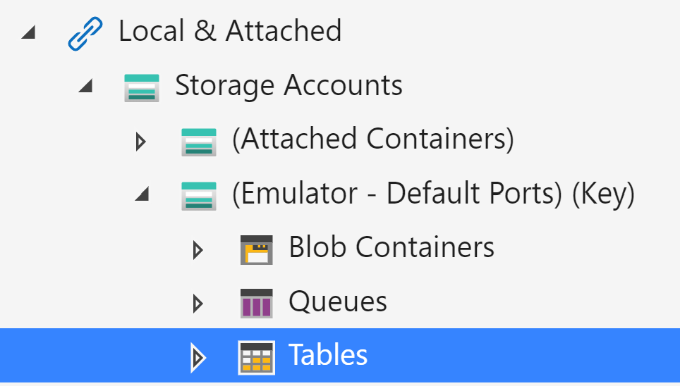

# Table Bindings

## Goal 🎯

The goal of this lesson is to learn how to table input and output bindings work.

This lessons consists of the following exercises:

|Nr|Exercise
|-|-
|1|[Using the Microsoft Azure Storage Explorer for Tables](#1-using-the-microsoft-azure-storage-explorer-for-tables)
|2|[Using `TableEntity` output bindings](#2-using-tableentity-output-bindings)
|3|[Using `IAsyncCollector<T>` Table output bindings](#3-using-iasynccollectort-table-output-bindings)
|4|[Using `TableEntity` input bindings](#4-using-`tableentity`-input-bindings)
|5|[Using `CloudMessage` input bindings](#5-using-cloudmessage-input-bindings)
|6|[Homework](#6-homework)
|7|[More info](#7-more-info)

> 📝 **Tip** - If you're stuck at any point you can have a look at the [source code](../src/AzureFunctions.Table) in this repository.

---

## 1. Using the Microsoft Azure Storage Explorer for Tables

In this exercise we'll look into storage emulation and the Azure Storage Explorer to see how you can interact with tables and entities.

### Steps

1. Make sure that the storage emulator is running and open the Azure Storage Explorer.
2. Navigate to `Storage Accounts` -> `(Emulator - Default Ports)(Key)` -> `Tables`.
    
3. Right-click `Tables` and select `Create Table`.
4. Type a name for the table: `players`
5. Select the new table.
   
   > 🔎 **Observation** - Now you see the contents of the table (which is still empty). In the top menu you see actions you can perform on the table or its records (entities).
6. Try adding a record to the table, you can use the following data:
    - PartitionKey: *United Kingdom*
    - RowKey: *52a3be19-dc1d-4f29-84a6-1013fcfddfa3*
    - Id: *52a3be19-dc1d-4f29-84a6-1013fcfddfa3*
    - NickName: Ada
    - Email: *ada@lovelace.org*
    - Region: *United Kingdom*

    > 🔎 **Observation** You'll see that the `PartitionKey` and `RowKey` values are also available in the `Region` and `Id` fields respectively. This type of 'entity modelling' is not required for Table entities. This is just they way we prefer to structure our data. We identify the fields in the business domain we want to use as keys and keep the original fields and their values as is. An alternative would be to only keep the `PartitionKey` and `RowKey` values and not include the `Id` and `Region` fields. But then you need a bit more mapping in your domain classes to map to the `Id` and `Region` fields again.

    > 📝 **Tip** - use the `Add Property` button to add new fields to the entity.

    

## 2. Using `TableEntity` output bindings

In this exercise, we'll be creating an HttpTrigger function and use the Queue output binding with a `string` type in order to put player messages on the `newplayer-items` queue.

### Steps

1. In VSCode, create a new HTTP Trigger Function App with the following settings:
   1. Location: *AzureFunctions.Table*
   2. Language: *C#*
   3. Template: *HttpTrigger*
   4. Function name: *StorePlayerReturnAttributeTableOutput*
   5. Namespace: *AzureFunctionsUniversity.Demo*  
   6. AccessRights: *Function*
2. Once the Function App is generated, add a reference to the `Microsoft.Azure.WebJobs.Extensions.Storage` NuGet package to the project. This allows us to use bindings for Blobs, Tables and Queues.

   > 📝 **Tip** - One way to easily do this is to use the _NuGet Package Manager_ VSCode extension:
   > 1. Run `NuGet Package Manager: Add new Package` in the Command Palette (CTRL+SHIFT+P).
   > 2. Type: `Microsoft.Azure.WebJobs.Extensions.Storage`
   > 3. Select the most recent (non-preview) version of the package.

3. We'll be working with a `Player` type, similar to the Blob and Queue lessons. However you can't reuse the exact same class since we will use a built-in type called `TableEntity`. 
    1. Create a new file to the project, called `PlayerEntity.cs`.
    2. Copy/paste [this content](../src/AzureFunctions.Table/Models/PlayerEntity.cs) into it.

        > 🔎 **Observation** - < OBSERVATION >

## 3. Using `IAsyncCollector<T>` Table output bindings

### Steps

1.
2.
3.

> 📝 **Tip** - < TIP >

> 🔎 **Observation** - < OBSERVATION >

> ❔ **Question** - < QUESTION >

## 4. Using `TableEntity` input bindings

### Steps

1.
2.
3.

> 📝 **Tip** - < TIP >

> 🔎 **Observation** - < OBSERVATION >

> ❔ **Question** - < QUESTION >

## 5. Using `CloudMessage` input bindings

### Steps

1.
2.
3.

> 📝 **Tip** - < TIP >

> 🔎 **Observation** - < OBSERVATION >

> ❔ **Question** - < QUESTION >

## 6 Homework

## 7 More info

---
[◀ Previous lesson](queue.md) | [🔼 Index](_index.md) | [Next lesson ▶](cosmosdb.md)